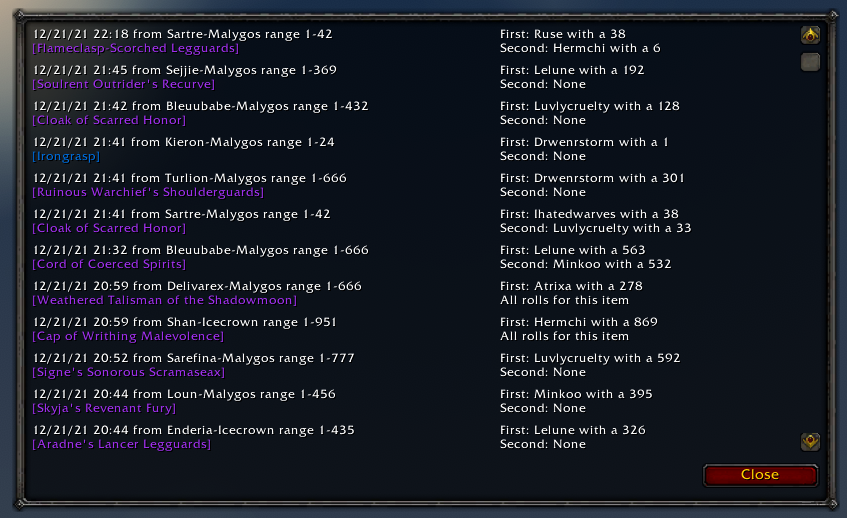

# LootRollLedger

Simple loot roll monitor and tracker for World of Warcraft.

This addon monitors item links sent to the raid/instance/party chat channel and then tracks rolls on that item. It uses the patented Luvly's Lovely Loot Rolling Method™️. This involves linking an item in raid chat followed by a number. It allows the raid to roll for multiple items at the same time. The addon will give folks two minutes to do a `/roll <number>` if they want the item.

## The Basics

1. Only one person needs to run this addon
2. A player links an item in raid chat followed by a number: "[Psyche Shredder] 414"
3. Use `/roll <number>` to roll on the item linked: "/roll 414"
4. After two minutes, the winner will be announced

## Commands

```
/lrl or /lootrollledger
  enable - Enable or disable all addon functionality (toggle)
  reporting - Enable or disable reporting results to raid chat (toggle)
  debug - Enable or disable additional logging (toggle)
  clear - Clear all active loot rolls
  search - Search previous item rolls
  history - Display loot roll history window
```

## Screenshots
Loot History Window


## Improvement Opportunities

1. If the same item is linked by different players they will be tracked separately
2. Roll ties are not handled correctly and only one of the two ties will be announced
