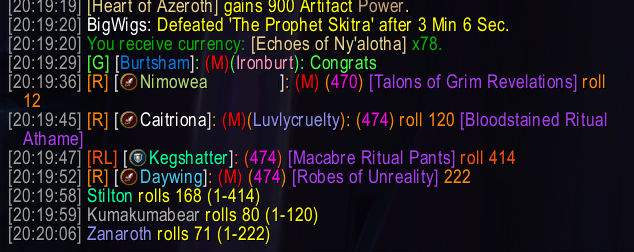
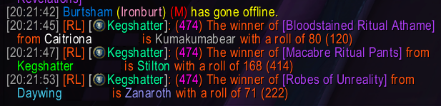

# LootRollLedger

Simple loot roll monitor and tracker for World of Warcraft.

This addon monitors item links sent to the raid/instance/party chat channel and then tracks rolls for those items. It uses the patented Luvly's Lovely Loot Rolling Method™️ for distributing items after a boss kill. This process involves linking an item to raid chat followed by a number. Raiders that want to roll on that item use `/roll <number>`, and the addon will track the entries and report the winner after two minutes. This allows the raid to roll for multiple items at the same time. The addon will give players two minutes to do a `/roll <number>` if they want the item.

**The player running this addon must have raid lead or raid assist permission to announce the winner publically.**

## Downloads

[CurseForge Project Page](https://www.curseforge.com/wow/addons/lootrollledger)

[WoW Interface Project Page](https://www.wowinterface.com/downloads/info25732-LootRollLedger.html)

## Instructions

1. Only one person (the raid lead or a raid assist) needs to run this addon
2. Player links an item in raid chat followed by a number. Example: "[Psyche Shredder] 414"
3. Interested players type `/roll <number>` to roll on the item linked. Example: "/roll 414"
4. After two minutes, the winner will be announced

## Commands

```
/lrl or /lootrollledger
  enable - Enable or disable all loot roll tracking (toggle)
  reporting - Enable or disable reporting results to raid chat (toggle)
  debug - Enable or disable additional logging (toggle)
  settings - Print current settings
  clear - Clear all active loot rolls
  instructions - Print instructions to chat window
  search - Search previous item rolls
  history - Display loot roll history window
```

## Screenshots
Rolling On New Items



Announcing Winners



Loot History Window


## Improvement Opportunities

1. If the same item is linked by different players, each item roll will be tracked separately.
2. Roll ties are not handled correctly and only one of the two ties will be announced.
3. Gear type and player spec is not checked so anyone can roll for anything.